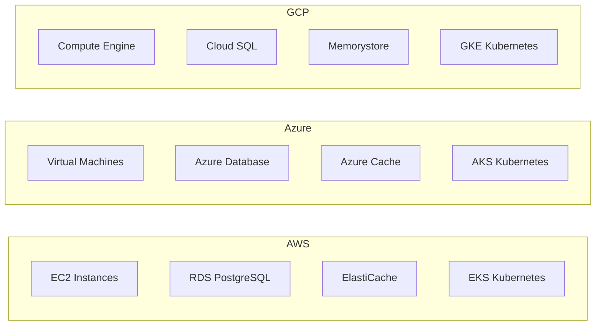

# Implementation Roadmap - Options Trading Platform

## Executive Summary

This roadmap outlines the 16-week development plan for the Stenoa Capital Executive Trading Platform, prioritizing the options trading UI and pricing comparison logic as requested.

## Development Phases Overview

### Phase 1: Foundation & Core Infrastructure (Weeks 1-4)
**Focus:** Setup development environment and basic framework

### Phase 2: Options Trading & Pricing Engine (Weeks 5-8)
**Focus:** Primary deliverable - Options UI and pricing comparison logic

### Phase 3: Advanced Trading Features (Weeks 9-12)
**Focus:** Basket trading, risk management, and conditional orders

### Phase 4: Production Deployment (Weeks 13-16)
**Focus:** Containerization, testing, and go-live preparation

---

## Phase 1: Foundation & Core Infrastructure (Weeks 1-4)

### Week 1: Development Environment Setup
**Deliverables:**
- [ ] Development environment configuration (Docker, IDE setup)
- [ ] C++ build system setup (CMake, dependencies)
- [ ] Vue.js project initialization with Quasar Framework
- [ ] PostgreSQL and Redis database setup
- [ ] Git repository structure and CI/CD pipeline basics

**Key Tasks:**
```bash
# Core dependencies for C++ backend
- Boost libraries (Beast, System, Thread)
- libpqxx for PostgreSQL
- hiredis for Redis
- nlohmann/json for JSON processing
- Google Test for unit testing

# Frontend dependencies
- Vue.js 3 with TypeScript
- Pinia for state management
- Quasar Framework for UI components
- Axios for HTTP client
- Socket.io-client for WebSocket
```

### Week 2: Database Schema Implementation
**Deliverables:**
- [ ] PostgreSQL database schema creation
- [ ] Database migration scripts
- [ ] Basic CRUD operations in C++
- [ ] Redis cache layer setup
- [ ] Database connection pooling

**Database Tables:**
- `portfolios` - Fund portfolio management
- `baskets` - Trading basket configurations  
- `basket_stocks` - Individual stock weights in baskets
- `orders` - Order lifecycle tracking
- `market_data` - Real-time and historical price data
- `positions` - Current portfolio positions

### Week 3: Basic Framework Development
**Deliverables:**
- [ ] C++ HTTP server with Boost.Beast
- [ ] RESTful API endpoint structure
- [ ] WebSocket server for real-time data
- [ ] Basic authentication middleware
- [ ] Error handling and logging framework
- [ ] Configuration management system

**API Endpoints Design:**
```cpp
// Core API structure
POST /api/auth/login
GET  /api/portfolios
GET  /api/market-data/{symbol}
POST /api/orders
GET  /api/orders/{id}
DELETE /api/orders/{id}
```

### Week 4: Zerodha API Integration
**Deliverables:**
- [ ] Zerodha API client implementation
- [ ] Market data feed integration
- [ ] Authentication flow with Zerodha
- [ ] Real-time tick data processing
- [ ] Basic order placement functionality

**Integration Components:**
```cpp
class ZerodhaClient {
    // Authentication
    bool login(const std::string& api_key, const std::string& access_token);
    
    // Market Data
    MarketQuote getQuote(const std::string& symbol);
    void subscribeTicks(const std::vector<std::string>& symbols);
    
    // Trading
    OrderResponse placeOrder(const OrderRequest& request);
    std::vector<Position> getPositions();
};
```

---

## Phase 2: Options Trading & Pricing Engine (Weeks 5-8) 
**PRIMARY FOCUS PHASE**

### Week 5: Options Trading UI Development
**Deliverables:**
- [ ] Options chain display component
- [ ] Strike price selection interface
- [ ] Multi-leg options strategy builder
- [ ] Real-time Greeks display (Delta, Gamma, Theta, Vega)
- [ ] Options position calculator

**UI Components:**
```vue
<template>
  <div class="options-trading-dashboard">
    <!-- Options Chain Display -->
    <OptionsChain 
      :underlying="selectedUnderlying" 
      :expiry="selectedExpiry"
      @strike-selected="onStrikeSelected" 
    />
    
    <!-- Strategy Builder -->
    <StrategyBuilder 
      :legs="strategyLegs"
      @leg-added="addLeg"
      @leg-removed="removeLeg" 
    />
    
    <!-- Position Calculator -->
    <PositionCalculator 
      :strategy="currentStrategy"
      :market-data="marketData" 
    />
  </div>
</template>
```

### Week 6: Pricing Comparison Logic Implementation
**Deliverables:**
- [ ] NSE vs BSE spot price comparison engine
- [ ] Current vs next month futures selection algorithm
- [ ] Fair value calculation for options and futures
- [ ] Liquidity analysis (volume and open interest)
- [ ] Optimal contract selection logic

**Core Pricing Algorithm:**
```cpp
class PricingEngine {
public:
    struct PriceComparison {
        std::string instrument_id;
        double nse_price;
        double bse_price;
        double fair_value;
        double liquidity_score;
        bool is_recommended;
    };
    
    std::vector<PriceComparison> compareContracts(
        const std::string& underlying,
        double target_quantity
    );
    
private:
    double calculateFairValue(const ContractDetails& contract);
    double calculateLiquidityScore(const MarketData& data);
    bool checkVolumeConstraints(const std::string& symbol, double quantity);
};
```

### Week 7: Advanced Pricing Features
**Deliverables:**
- [ ] 30-day average volume calculations
- [ ] 5% volume limit compliance checks
- [ ] Margin requirement calculator
- [ ] Percentage difference analyzer for optimal selection
- [ ] Real-time pricing dashboard

**Margin Calculation:**
```cpp
class MarginCalculator {
public:
    double calculateRequiredMargin(const std::vector<Position>& positions);
    double calculateSpanMargin(const Position& position);
    double calculateExposureMargin(const Position& position);
    bool validateMarginAvailability(double required_margin);
};
```

### Week 8: Options UI Integration & Testing
**Deliverables:**
- [ ] Complete options trading interface
- [ ] Real-time price updates integration
- [ ] Order preview and confirmation dialogs
- [ ] Risk metrics display
- [ ] Unit tests for pricing logic
- [ ] Integration tests for UI components

---

## Phase 3: Advanced Trading Features (Weeks 9-12)

### Week 9: Basket Trading Implementation
**Deliverables:**
- [ ] NIFTY50 basket configuration interface
- [ ] Basket weight allocation system
- [ ] Portfolio rebalancing calculator
- [ ] Bulk order generation for baskets
- [ ] Capital allocation optimizer (₹100 crores input handling)

### Week 10: Order Management System
**Deliverables:**
- [ ] Advanced order lifecycle management
- [ ] Slice order execution for large quantities
- [ ] Exchange rule compliance engine
- [ ] Order routing optimization (NSE/BSE selection)
- [ ] Trade confirmation and settlement tracking

### Week 11: Risk Management & Conditional Orders
**Deliverables:**
- [ ] Real-time portfolio value monitoring
- [ ] Conditional order parser (`((x>20)||(y<50)) &&` syntax)
- [ ] Stop-loss automation
- [ ] Position limit enforcement
- [ ] Emergency liquidation controls

### Week 12: Advanced UI Features
**Deliverables:**
- [ ] Complete trading dashboard
- [ ] Portfolio analytics and reporting
- [ ] Trade history and audit trail
- [ ] Risk dashboard with alerts
- [ ] Market condition monitoring interface

---

## Phase 4: Production Deployment (Weeks 13-16)

### Week 13: Containerization & DevOps
**Deliverables:**
- [ ] Docker containers for all services
- [ ] Kubernetes deployment manifests
- [ ] CI/CD pipeline implementation
- [ ] Environment-specific configurations
- [ ] Automated testing pipeline

### Week 14: Performance Optimization & Security
**Deliverables:**
- [ ] Performance profiling and optimization
- [ ] Security audit and penetration testing
- [ ] SSL/TLS implementation
- [ ] API rate limiting and authentication
- [ ] Data encryption at rest and in transit

### Week 15: Testing & Quality Assurance
**Deliverables:**
- [ ] Comprehensive integration testing
- [ ] Load testing with simulated market conditions
- [ ] User acceptance testing
- [ ] Documentation completion
- [ ] Operational runbooks

### Week 16: Production Deployment
**Deliverables:**
- [ ] Production environment setup
- [ ] Live trading environment configuration
- [ ] Monitoring and alerting system
- [ ] Backup and disaster recovery
- [ ] Go-live checklist completion

---

## Key Milestones & Reviews

### Milestone 1 (End of Week 4): Foundation Complete
**Review Criteria:**
- Development environment fully operational
- Database schema implemented and tested
- Basic API framework functional
- Zerodha API integration working

### Milestone 2 (End of Week 8): Core Features Complete ⭐
**Review Criteria:**
- Options trading UI fully functional
- Pricing comparison logic implemented and tested
- Real-time market data integration working
- Basic order placement functional

### Milestone 3 (End of Week 12): Advanced Features Complete
**Review Criteria:**
- Basket trading operational
- Risk management system functional
- Conditional orders working
- Complete trading workflow tested

### Milestone 4 (End of Week 16): Production Ready
**Review Criteria:**
- System deployed and operational
- All security measures implemented
- Performance benchmarks met
- Production monitoring active

---

## Resource Requirements

### Development Team
- **Backend Developer (C++)**: 1 senior developer
- **Frontend Developer (Vue.js)**: 1 mid-level developer  
- **DevOps Engineer**: 0.5 FTE (part-time for infrastructure)
- **QA Engineer**: 0.5 FTE (testing and validation)

### Infrastructure Costs (Monthly Estimates)
- **Development Environment**: $200-300
- **Staging Environment**: $300-500
- **Production Environment**: $800-1200
- **Market Data Feeds**: $500-1000 (Zerodha API)
- **Monitoring & Backup**: $100-200

### Cloud Provider Comparison


---

## Risk Mitigation

### Technical Risks
1. **Market Data Latency**: Implement local caching and optimized WebSocket handling
2. **Exchange Connectivity Issues**: Build redundant connections and failover mechanisms
3. **Performance Bottlenecks**: Continuous profiling and optimization throughout development
4. **Security Vulnerabilities**: Regular security audits and penetration testing

### Business Risks
1. **Regulatory Compliance**: Consult with compliance team throughout development
2. **Market Volatility**: Build robust risk management controls
3. **Data Accuracy**: Implement multiple data validation layers
4. **Operational Risk**: Comprehensive testing and rollback procedures

### Contingency Plans
- **Week 4 Delay**: Extend Phase 1 by 1 week, adjust subsequent phases
- **Week 8 Delay**: Critical milestone - consider additional resources
- **Technology Issues**: Have backup technology choices ready (e.g., Node.js as C++ alternative)
- **Resource Constraints**: Identify external contractors for specific components

This roadmap prioritizes your core requirements while building a scalable foundation for future enhancements. The focus on options trading UI and pricing comparison in Phase 2 aligns with your stated priorities.