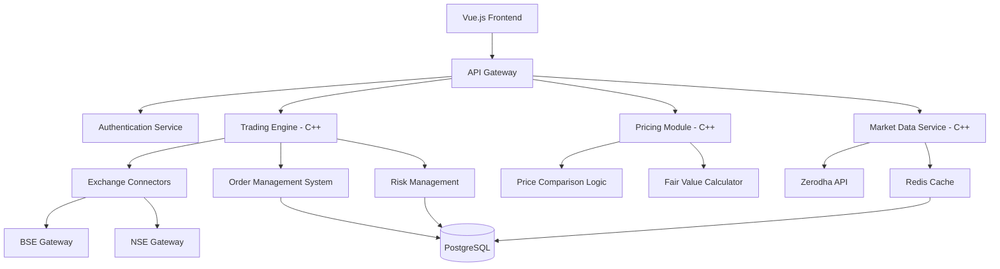

# Options Trading Execution Platform - Technical Specification

## Project Overview

**Project Name:** Stenoa Capital Executive Trading Platform  
**Type:** Low-frequency options trading execution platform for proprietary fund  
**Architecture:** Containerized microservices (hybrid local/cloud deployment)  
**Frontend:** Vue.js  
**Backend:** C++  
**Target Users:** Fund managers and traders  

## System Architecture

### High-Level Architecture



### Core Components

#### 1. Frontend Layer (Vue.js)
- **Trading Dashboard**: Real-time portfolio view and order entry
- **Options UI**: Strike selection, pricing display, quantity calculation
- **Basket Management**: NIFTY50 basket configuration and execution
- **Risk Monitoring**: Real-time P&L and risk metrics
- **Conditional Orders**: Complex condition parser and manager

#### 2. Backend Services (C++)

##### Trading Engine
- Order routing and execution logic
- Lot size calculations and rounding
- Market vs limit order handling
- Slice order execution compliance

##### Pricing Module
- Spot vs futures comparison (NSE/BSE)
- Fair value calculations
- Optimal contract selection logic
- Margin requirement calculations

##### Market Data Service
- Real-time price feeds from Zerodha
- Volume and open interest tracking
- 30-day average volume calculations
- Price validation and normalization

##### Order Management System (OMS)
- Order lifecycle management
- Exchange rule compliance
- Trade confirmation and settlement
- Position tracking and reconciliation

## Technical Requirements

### Performance Requirements
- **Latency**: < 100ms order processing
- **Throughput**: 1000+ orders per second
- **Availability**: 99.9% uptime during market hours
- **Data Processing**: Real-time tick data handling

### Functional Requirements

#### Core Trading Features
1. **Basket Trading**
   - NIFTY50 basket with configurable weightages
   - Input: ₹100 crores capital allocation
   - Output: Optimal quantities per stock
   - 5% volume limit compliance

2. **Options Trading**
   - Multi-leg options strategies
   - Strike price optimization
   - Expiry management
   - Greeks calculation

3. **Price Comparison**
   - NSE vs BSE spot price comparison  
   - Current vs next month futures selection
   - Fair value vs market price analysis
   - Liquidity-based routing decisions

4. **Risk Management**
   - Position size limits
   - Market value monitoring
   - Conditional execution triggers
   - Stop-loss automation

#### Data Management
- Portfolio position tracking
- Historical trade data
- Market data archival
- Basket configurations storage

## Database Design

### Primary Database: PostgreSQL

#### Core Tables
```sql
-- Portfolio Management
CREATE TABLE portfolios (
    id SERIAL PRIMARY KEY,
    name VARCHAR(100) NOT NULL,
    capital DECIMAL(15,2) NOT NULL,
    created_at TIMESTAMP DEFAULT NOW()
);

-- Basket Configurations  
CREATE TABLE baskets (
    id SERIAL PRIMARY KEY,
    portfolio_id INTEGER REFERENCES portfolios(id),
    name VARCHAR(100) NOT NULL,
    total_weightage DECIMAL(5,2) DEFAULT 100.00
);

CREATE TABLE basket_stocks (
    id SERIAL PRIMARY KEY,
    basket_id INTEGER REFERENCES baskets(id),
    ticker VARCHAR(20) NOT NULL,
    weightage DECIMAL(5,2) NOT NULL,
    direction ENUM('LONG', 'SHORT') NOT NULL
);

-- Trading Data
CREATE TABLE orders (
    id SERIAL PRIMARY KEY,
    portfolio_id INTEGER REFERENCES portfolios(id),
    ticker VARCHAR(20) NOT NULL,
    instrument_type ENUM('CASH', 'FUTURE', 'OPTION') NOT NULL,
    quantity INTEGER NOT NULL,
    price DECIMAL(10,2),
    side ENUM('BUY', 'SELL') NOT NULL,
    status ENUM('PENDING', 'EXECUTED', 'REJECTED', 'CANCELLED') NOT NULL,
    exchange ENUM('NSE', 'BSE') NOT NULL,
    created_at TIMESTAMP DEFAULT NOW(),
    executed_at TIMESTAMP
);

-- Market Data
CREATE TABLE market_data (
    id SERIAL PRIMARY KEY,
    ticker VARCHAR(20) NOT NULL,
    price DECIMAL(10,2) NOT NULL,
    volume BIGINT,
    open_interest BIGINT,
    exchange ENUM('NSE', 'BSE') NOT NULL,
    timestamp TIMESTAMP DEFAULT NOW(),
    INDEX(ticker, timestamp)
);
```

### Cache Layer: Redis
- Real-time price caching
- Session management
- Order status tracking
- Market data buffering

## Technology Stack

### Frontend
- **Framework**: Vue.js 3 with Composition API
- **State Management**: Pinia
- **UI Library**: Quasar Framework
- **Charts**: TradingView Charting Library
- **Real-time**: WebSocket connections

### Backend
- **Language**: C++17/20
- **Framework**: Custom HTTP server with Boost.Beast
- **JSON Processing**: nlohmann/json
- **HTTP Client**: libcurl for exchange APIs
- **WebSocket**: Boost.Beast WebSocket
- **Database**: libpqxx (PostgreSQL C++ client)
- **Redis**: hiredis C++ client

### Infrastructure
- **Containers**: Docker with multi-stage builds
- **Orchestration**: Docker Compose (local) / Kubernetes (cloud)
- **Message Queue**: Redis Pub/Sub
- **Monitoring**: Prometheus + Grafana
- **Logging**: spdlog (structured logging)

## Market Data Integration

### Zerodha API Integration
```cpp
class ZerodhaConnector {
public:
    bool authenticate(const std::string& api_key, const std::string& access_token);
    MarketData getQuote(const std::string& instrument_token);
    std::vector<MarketData> getQuotes(const std::vector<std::string>& instruments);
    bool subscribeToTicks(const std::vector<std::string>& instruments);
    OrderResponse placeOrder(const OrderRequest& order);
    std::vector<Position> getPositions();
};
```

### Data Flow
1. **Real-time Feeds**: WebSocket connection to Zerodha
2. **Price Updates**: Redis pub/sub for internal distribution  
3. **Historical Data**: PostgreSQL for analysis and backtesting
4. **Cache Strategy**: 1-second price caching for high-frequency queries

## Pricing Logic Implementation

### Fair Value Calculation
```cpp
struct ContractComparison {
    std::string contract_id;
    double market_price;
    double fair_value;
    double percentage_diff;
    bool is_liquid;
    int days_to_expiry;
};

class PricingEngine {
public:
    ContractComparison findOptimalContract(
        const std::string& underlying,
        double target_quantity,
        const std::vector<std::string>& available_contracts
    );
    
private:
    double calculateFairValue(const ContractDetails& contract);
    bool checkLiquidity(const std::string& contract_id, double required_quantity);
};
```

### Decision Matrix
1. **Liquidity Check**: Volume > 5% of 30-day average
2. **Cost Efficiency**: Lowest percentage difference from fair value
3. **Execution Feasibility**: Available lot sizes vs required quantity
4. **Risk Considerations**: Open interest and bid-ask spread

## Order Management System

### Order Processing Pipeline
```cpp
class OrderManager {
public:
    OrderID submitOrder(const OrderRequest& request);
    bool cancelOrder(OrderID order_id);
    OrderStatus getOrderStatus(OrderID order_id);
    
private:
    bool validateOrder(const OrderRequest& request);
    std::vector<SliceOrder> createSlices(const OrderRequest& request);
    bool routeToExchange(const SliceOrder& slice);
    void updateOrderStatus(OrderID order_id, OrderStatus status);
};
```

### Compliance Features
- **Lot Size Validation**: Automatic lot-based quantity adjustment
- **Price Collar**: Market order price protection
- **Position Limits**: Real-time position monitoring
- **Exchange Rules**: NSE/BSE specific validations

## Risk Management Framework

### Real-time Monitoring
```cpp
class RiskManager {
public:
    bool checkPositionLimits(const OrderRequest& order);
    bool evaluateMarketConditions();
    void updateMarketValueWatcher();
    bool parseConditions(const std::string& condition_string);
    
private:
    double calculatePortfolioValue();
    bool evaluateCondition(const ParsedCondition& condition);
    void triggerEmergencyStop();
};
```

### Conditional Execution
- **Condition Parser**: `((x>20)||(y<50)) &&` syntax support
- **Trigger Management**: Real-time condition evaluation
- **Emergency Controls**: Immediate position liquidation
- **Margin Monitoring**: Pre-trade margin requirement checks

## Security & Authentication

### Authentication Flow
1. **JWT Tokens**: Stateless authentication
2. **API Key Management**: Per-user API key rotation
3. **Exchange Credentials**: Encrypted storage of broker credentials
4. **Session Management**: Redis-based session tracking

### Security Measures
- **HTTPS/WSS**: All communications encrypted
- **API Rate Limiting**: Per-user request throttling
- **Audit Logging**: Complete trade audit trail
- **Data Encryption**: Sensitive data encrypted at rest

## Deployment Strategy

### Containerization
```dockerfile
# Multi-stage C++ build
FROM ubuntu:22.04 AS builder
RUN apt-get update && apt-get install -y \
    g++ cmake libboost-all-dev libpqxx-dev \
    libcurl4-openssl-dev libhiredis-dev
COPY . /app
WORKDIR /app
RUN cmake . && make -j$(nproc)

FROM ubuntu:22.04 AS runtime
RUN apt-get update && apt-get install -y \
    libboost-system1.74.0 libpqxx-6.4 \
    libcurl4 libhiredis0.14
COPY --from=builder /app/trading_platform /usr/local/bin/
EXPOSE 8080
CMD ["/usr/local/bin/trading_platform"]
```

### Container Architecture
- **Trading Engine**: Core C++ trading logic
- **API Gateway**: HTTP/WebSocket endpoint management
- **Database**: PostgreSQL with persistent volumes
- **Cache**: Redis for session and market data
- **Frontend**: Nginx serving Vue.js application

### Cloud Infrastructure (AWS/Azure/GCP)
- **Compute**: Container instances with auto-scaling
- **Storage**: Managed PostgreSQL + Redis services  
- **Networking**: VPC with private subnets for trading components
- **Monitoring**: CloudWatch/Azure Monitor integration
- **Backup**: Automated database backups and disaster recovery

## Development Phases

### Phase 1: Foundation (Weeks 1-4)
- [ ] Development environment setup
- [ ] Database schema implementation
- [ ] Basic C++ framework and HTTP server
- [ ] Vue.js project initialization
- [ ] Zerodha API integration

### Phase 2: Core Trading (Weeks 5-8)  
- [ ] Options trading UI implementation
- [ ] Pricing comparison logic
- [ ] Basic order management system
- [ ] Real-time market data integration
- [ ] WebSocket communication layer

### Phase 3: Advanced Features (Weeks 9-12)
- [ ] Basket trading functionality
- [ ] Risk management system
- [ ] Conditional order execution
- [ ] Portfolio tracking and reporting
- [ ] Exchange connectivity optimization

### Phase 4: Production Ready (Weeks 13-16)
- [ ] Containerization and deployment
- [ ] Performance optimization
- [ ] Security hardening
- [ ] Comprehensive testing
- [ ] Production deployment and monitoring

## Testing Strategy

### Unit Testing
- **C++ Backend**: Google Test framework
- **Vue.js Frontend**: Jest + Vue Test Utils
- **Database**: Integration tests with test data

### Integration Testing  
- **API Testing**: Postman/Newman automated tests
- **Exchange Simulation**: Mock exchange for order testing
- **Performance Testing**: Load testing with realistic market data

### Quality Assurance
- **Code Review**: Pull request reviews
- **Static Analysis**: Clang-tidy, ESLint
- **Security Scanning**: Container vulnerability scans
- **Penetration Testing**: Third-party security audit

This specification provides the foundation for building a robust, scalable options trading platform that meets your fund's requirements while maintaining high performance and regulatory compliance.